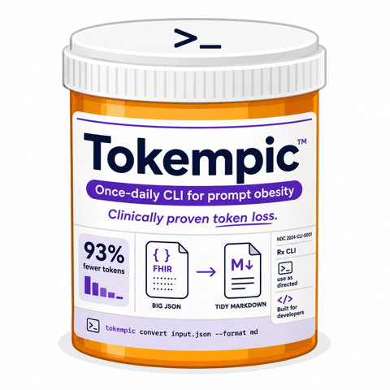

# Tokempic

<p align="center">
  
</p>

Fetch one patient's record from a FHIR server and render a compact, token-lean
Markdown summary for an LLM. What is included is defined by standard SQL-on-FHIR
ViewDefinitions; how it is laid out is defined by an `eta` template.

## Install

Tokempic runs as a `tokempic` command. Pick one:

**Standalone binary** (no runtime needed afterwards):

```bash
bun run build      # produces ./tokempic — a self-contained executable
```

The binary embeds the default ViewDefinitions and template, so it works from any
directory with no extra files. Move it onto your `PATH` (e.g. `mv tokempic /usr/local/bin/`)
to call `tokempic` from anywhere.

**Global command via Bun** (for development):

```bash
bun link           # makes `tokempic` available on your PATH, backed by Bun
```

Either way you then invoke `tokempic` directly instead of `bun run src/cli.ts`.

## Usage

```bash
tokempic \
  --patient <id> \
  --server https://fhir.example.org/fhir \
  --token "$(gcloud auth print-access-token)" \
  --out summary.md
```

Flags: `--patient` (required), `--server` (required), `--token` (or `TOKEMPIC_TOKEN`),
`--views` (a directory of ViewDefinition JSON files; defaults to the built-in set),
`--template` (defaults to the built-in layout), `--out` (default stdout), `--since`,
plus the caching flags below.

The fetched resource types are derived automatically from the `resource` field of the
ViewDefinitions and passed to `Patient/$everything?_type=…`. Supply `--views ./my-views`
to override the built-in set with your own.

## Why — size and speed

The point of tokempic is to turn a sprawling FHIR `$everything` bundle into something
small enough to drop into an LLM prompt. For one example patient with the built-in views:

| | Full `$everything` bundle | tokempic markdown |
| --- | ---: | ---: |
| Size | 72.5 KB | 5.0 KB |
| ~Tokens (chars ÷ 4) | ~18,100 | ~1,260 |

That is **~14× smaller — a ~93% reduction** in bytes and tokens, while keeping the
clinically relevant facts. (Numbers are for a single patient and approximate; your
mileage varies with record size and views.)

Caching then cuts the wall-clock cost of repeated runs:

| Run | What happens | Time |
| --- | --- | ---: |
| Cold | full fetch + render | ~1.7 s |
| Incremental, no changes | `_since` probe returns empty, cache reused | ~0.8 s |
| `--max-age` fresh | network skipped entirely | ~0.06 s |

## Caching

To avoid re-pulling a patient's whole record on every run, tokempic caches the fetched
resources under `~/.cache/tokempic/` (override with `XDG_CACHE_HOME` or `--cache-dir`),
keyed by `(server, patient, viewset)`.

By default, runs are **incremental**: tokempic remembers the highest `meta.lastUpdated`
it has seen and asks the server for only what changed since
(`Patient/$everything?_since=…`). If nothing changed, the delta comes back empty and the
cached data is reused — a single tiny request instead of a full paginated pull. New and
updated resources are merged into the cache.

Caching flags:

- `--max-age <dur>` — if the cache is younger than this, skip the server **entirely**
  (offline / fastest path). Accepts `30s`, `10m`, `2h`, `1d`, or bare seconds.
- `--refresh` — ignore the cache and do a full fetch (also rebuilds the cache).
- `--no-cache` — bypass the cache completely; do not read or write it.
- `--cache-dir <dir>` — store cache files somewhere other than `~/.cache/tokempic/`.

```bash
tokempic --patient <id> --server "$BASE" --token "$TOK" --out s.md             # incremental
tokempic --patient <id> --server "$BASE" --token "$TOK" --max-age 1h --out s.md # skip server if cache < 1h old
tokempic --patient <id> --server "$BASE" --token "$TOK" --refresh --out s.md    # force full refresh
```

> **Caveat — deletions:** incremental fetches detect new and updated resources but not
> *deletions* (a removed resource simply stops appearing in `_since` results, with no
> tombstone). A resource deleted on the server lingers in the cache until you run with
> `--refresh`.

## Google Cloud Healthcare API

```bash
PROJECT=my-project
LOCATION=us-central1
DATASET=my-dataset
STORE=my-store
BASE="https://healthcare.googleapis.com/v1/projects/$PROJECT/locations/$LOCATION/datasets/$DATASET/fhirStores/$STORE/fhir"

tokempic \
  --patient <patient-id> \
  --server "$BASE" \
  --token "$(gcloud auth print-access-token)" \
  --out summary.md
```

The bearer token from `gcloud auth print-access-token` is short-lived; re-run for a fresh one.
Requires `roles/healthcare.fhirResourceReader` on the dataset or store.

### Convenience wrapper (`.env` + `run.sh`)

Rather than retyping the server URL and service account each time, keep them in a
`.env` next to the binary (git-ignored — it holds the FHIR store coordinates):

```bash
# .env
SA=my-sa@my-project.iam.gserviceaccount.com
BASE=https://healthcare.googleapis.com/v1/projects/my-project/locations/us-central1/datasets/my-dataset/fhirStores/my-store/fhir
```

`tokempic` itself does not read `.env`, so either source it before calling the
binary directly:

```bash
set -a; source .env; set +a
tokempic --patient <id> --server "$BASE" --token "$(gcloud auth print-access-token --account=$SA)" --out summary.md
```

…or use the bundled `run.sh`, which sources `.env`, fetches a fresh token, and
runs `tokempic` in one step:

```bash
./run.sh <patient-id>                 # writes <patient-id>-summary.md
./run.sh <patient-id> summary.md      # or name the output explicitly
```

## Claude Code plugin

This repo doubles as a [Claude Code](https://docs.claude.com/en/docs/claude-code)
plugin marketplace, so an agent can learn how to drive tokempic. Install it with:

```text
/plugin marketplace add recodelabs/tokempic
/plugin install tokempic@tokempic
```

That adds the `using-tokempic` skill, which teaches Claude when and how to run the
CLI (auth, flags, caching, troubleshooting). The skill lives in
`skills/using-tokempic/`; the marketplace and plugin manifests are in
`.claude-plugin/`.

## Develop

```bash
bun install
bun test
bun run src/cli.ts --patient <id> --server <url>   # run from source without installing
```
