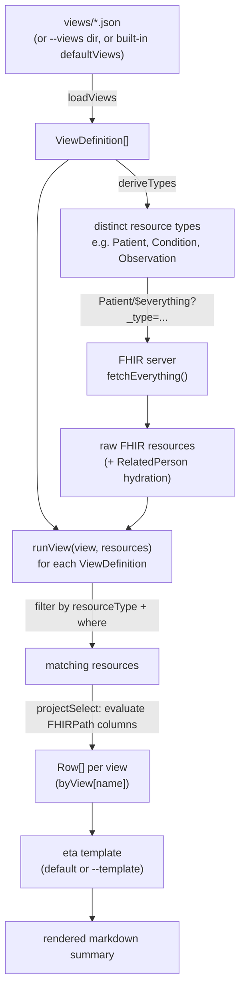

# ViewDefinitions in Tokempic
tokempic doesn't hard-code which FHIR fields end up in a patient summary. Every section of the output is driven by a [SQL-on-FHIR **ViewDefinition**](https://sql-on-fhir.org/ig/latest/) — a small JSON file that declares *which resource to read* and *which fields to pull out of it* using [FHIRPath](https://hl7.org/fhirpath/). This doc traces how a ViewDefinition flows end to end, from JSON file to rendered markdown.
## Where they live
```
views/
├── demographics.json
├── conditions.json
├── medications.json
├── allergies.json
├── procedures.json
├── immunizations.json
├── encounters.json
├── relatedpersons.json
├── labs.json
└── vitals.json
```

One file per summary section. If you pass `--views ./my-views`, tokempic loads that directory instead; otherwise it falls back to a built-in set baked into the binary (`src/default-views.ts`).
## Anatomy of a ViewDefinition
`views/labs.json`:

```json
{
  "name": "labs",
  "resource": "Observation",
  "where": [
    {
      "path": "category.coding.where(code='laboratory').exists()"
    }
  ],
  "select": [
    {
      "column": [
        {
          "name": "date",
          "path": "effectiveDateTime"
        },
        {
          "name": "code",
          "path": "code.coding.first().code"
        },
        {
          "name": "display",
          "path": "code.coding.first().display"
        },
        {
          "name": "value",
          "path": "valueQuantity.value"
        },
        {
          "name": "unit",
          "path": "valueQuantity.unit"
        }
      ]
    }
  ]
}
```

- `resource` — the FHIR resource type this view reads (`Observation`, `Patient`, `Condition`, ...).
- `where` — optional FHIRPath guard(s); a resource must satisfy all of them to be included.
- `select.column` — output column name paired with a FHIRPath expression evaluated against the resource.
- `select.forEach` — (used by other views, e.g. nested lists) projects a sub-element repeatedly, producing one row per match.

The shape is defined in `src/types.ts` (`ViewDefinition`, `SelectClause`, `WhereClause`, `Column`).
## The pipeline


Step by step:

1. **Load** — `loadViews()` (`src/views.ts`) reads each JSON file in the views directory into a `ViewDefinition`.
2. **Derive fetch scope** — `deriveTypes(views)` collects the distinct `resource` values across all loaded views and passes them to `Patient/$everything?_type=…` (`src/cli.ts`), so the server is only asked for resource types the views actually need.
3. **Fetch** — `fetchEverything()` pulls the matching resources from the FHIR server (`src/fhir-client.ts`), with `RelatedPerson` references resolved to their `Patient` records (`src/related-person.ts`). Caching/incremental fetch logic (`src/cache.ts`) sits in front of this step but doesn't change what gets fetched, only when.
4. **Run each view** — `runView(view, resources)` (`src/view-runner.ts`) filters resources to those matching `view.resource` and passing `where`, then `projectSelect()` evaluates each column's FHIRPath expression (via the `fhirpath` library) to produce flat `Row[]` — one row-set per view, keyed by view name.
5. **Render** — all row-sets are handed to `render()` (`src/render.ts`) along with an `eta` template (`src/default-template.ts`, or `--template`), which lays each view's rows out as a markdown section.
## Why this matters
Because the fetch scope and the extracted fields are *both* derived from the same ViewDefinitions, swapping `--views` changes the whole pipeline consistently — no separate config to keep in sync. It's also the reason the output is so much smaller than the source bundle: views only pull the columns that matter, instead of carrying full FHIR resources through to the summary. See the README's [size comparison](./README.md#why--size-and-speed) for numbers.
